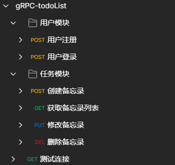

# gRPC-todoList

gin+grpc+gorm+etcd+mysql 备忘录功能
# 注意
V2版本和v1版本的项目结构改变很大。

# 项目主要依赖
- gin
- gorm
- etcd
- grpc
- jwt-go
- logrus
- viper
- protobuf

# 项目结构

## 1.grpc_todolist 项目总体
```
grpc-todolist/
├── app                   // 各个微服务
│   ├── gateway           // 网关
│   ├── task              // 任务模块微服务
│   └── user              // 用户模块微服务
├── bin                   // 编译后的二进制文件模块
├── config                // 配置文件
├── consts                // 定义的常量
├── doc                   // 接口文档
├── idl                   // protoc文件
│   └── pb                // 放置生成的pb文件
├── logs                  // 放置打印日志模块
├── pkg                   // 各种包
│   ├── e                 // 统一错误状态码
│   ├── discovery         // etcd服务注册、keep-alive、获取服务信息等等
│   ├── res               // 统一response接口返回
│   └── util              // 各种工具、JWT、Logger等等..
└── types                 // 定义各种结构体
```

## 2.gateway 网关部分
```
gateway/
├── cmd                   // 启动入口
├── internal              // 业务逻辑（不对外暴露）
│   ├── handler           // 视图层
│   └── service           // 服务层
│       └── pb            // 放置生成的pb文件
├── logs                  // 放置打印日志模块
├── middleware            // 中间件
├── routes                // http 路由模块
└── rpc                   // rpc 调用
```

## 3.user && task 用户与任务模块
```
user/
├── cmd                   // 启动入口
└──internal               // 业务逻辑（不对外暴露）
   ├── service            // 业务服务
   └── repository         // 持久层
       └── db             // 视图层
           ├── dao        // 对数据库进行操作
           └── model      // 定义数据库的模型
```


# 项目文件配置

`config/config.yml`文件，直接将 `config.yml.example-->config.yml` 就可以了


```yaml
server: # 项目配置
  port: :4000 # 项目端口
  version: 1.0 
  jwtSecret: 38324

mysql: # mysql相关配置
  driverName: mysql
  host: 127.0.0.1
  port: 3306
  database: grpc_todolist
  username: grpc_todolist
  password: grpc_todolist
  charset: utf8mb4

redis: # redis相关配置，其实没有用到redis...
  user_name: default
  address: 127.0.0.1:6379
  password:

etcd: # etcd相关配置
  address: 127.0.0.1:2379

services: # 各个微服务的配置
  gateway:
    name: gateway
    loadBalance: true
    addr:
      - 127.0.0.1:10001
  user:
    name: user
    loadBalance: false
    addr:
      - 127.0.0.1:10002 # user模块地址
  task:
    name: task
    loadBalance: false
    addr:
      - 127.0.0.1:10003 # task模块地址

domain:
  user:
    name: user
  task:
    name: task
```

# 项目启动
## makefile启动

启动命令

```shell
make env-up         # 启动容器环境
make user           # 启动用户摸块
make task           # 启动任务模块
make gateway        # 启动网关
make env-down       # 关闭并删除容器环境
```

其他命令
```shell
make proto # 生成proto文件，如果proto有改变的话，则需要重新生成文件
```
生成.pb文件所需要的工具有`protoc-gen-go`,`protoc-gen-go-grpc`,`protoc-go-inject-tag`


## 手动启动

1. 利用compose快速构建环境

```shell
docker-compose up -d
```

2. 保证mysql,etcd活跃, 在 app 文件夹下的各个模块的 cmd 下执行

```go
go run main.go
```

# 导入接口文档

打开postman，点击导入


选择导入文件


效果


